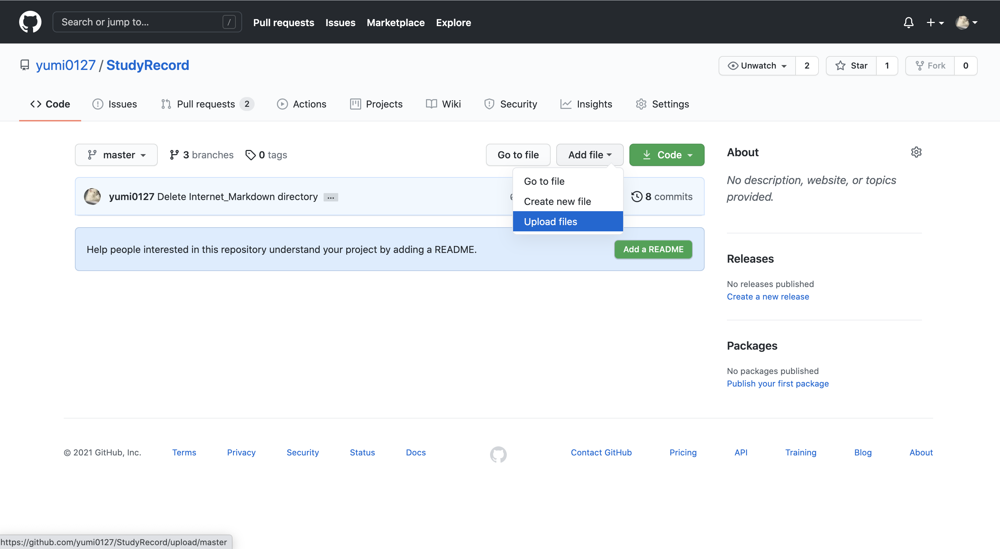
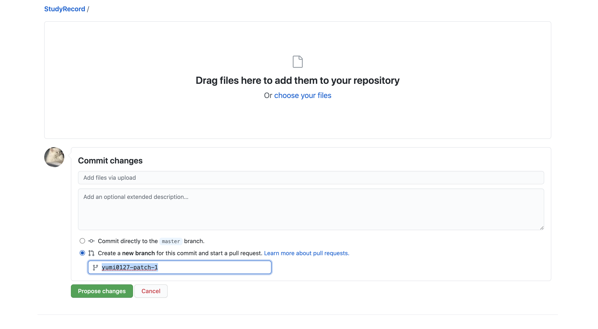
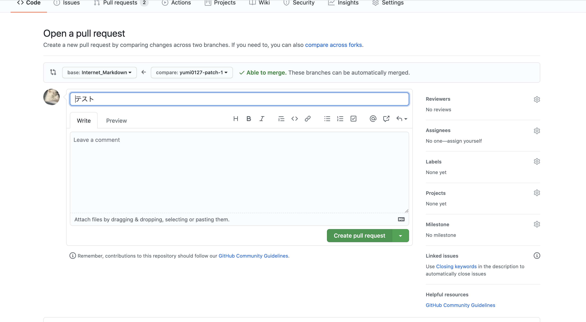
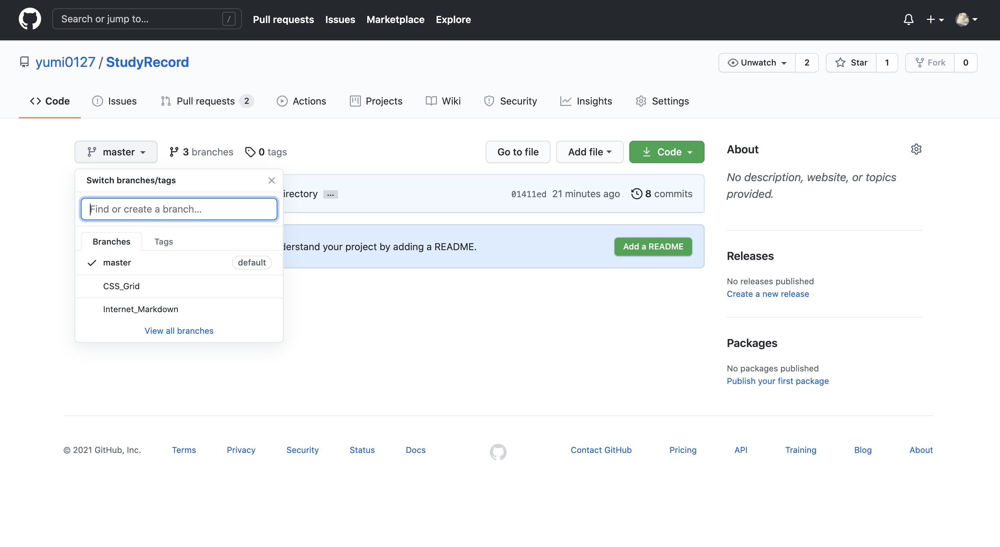
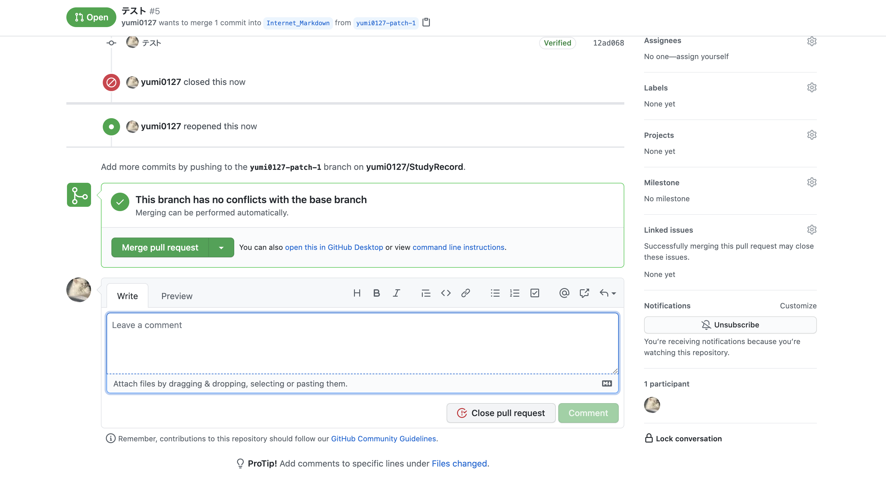
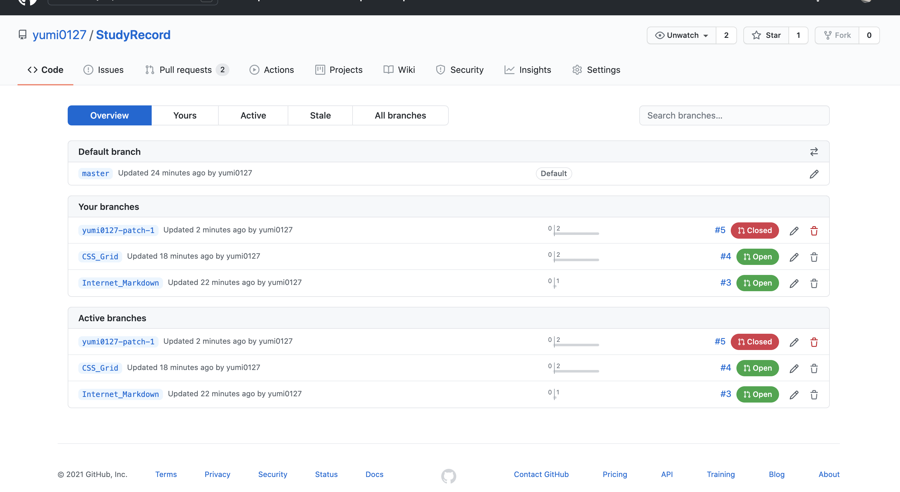
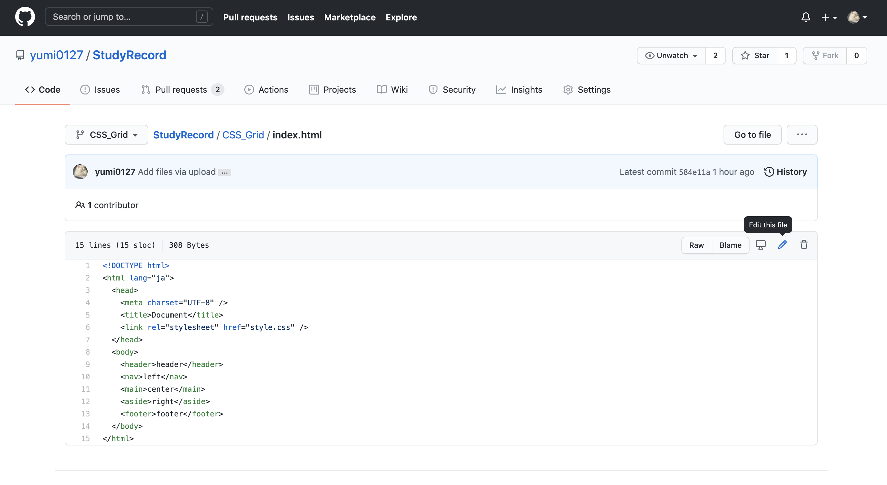
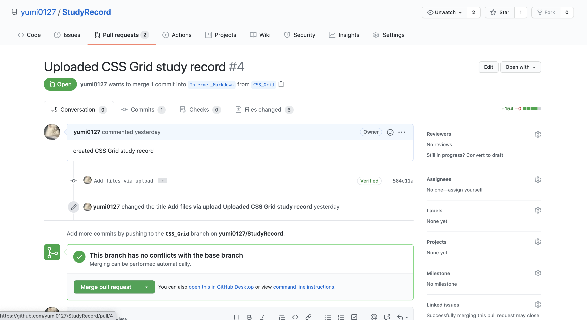

# Git学習内容(4/25)
- git push origin mainと書く場合、originがremote、mainがbranchに該当している。originまでは定形文なので基本変える必要はないが、branchに関しては、どこのbranchにcommitした変更内容をuploadするかを指定する必要がある。
- 普通にリポジトリを作成するとmainというbranchが勝手に作られる。
古いリポジトリだとmasterが作成される。
- origin master(main)でbranchを作成することはほとんどない。なぜなら基本開発現場ではpull requestする為、都度新規のbranchとpull requestを作成する方が良い。
- 新規のファイルをuploadする際は、同時にbranchとpull requestの作成をするべき。pull requestは差分ベースで記録される為、最初にファイルをuploadしてからpull requestをすると最初の内容が記録として残らない。
- ファイルのuploadや編集のみならず、削除もgithubのリポジトリの歴史の一部となる。commitはこまめに行う方が良い。なぜなら、1000行の修正を一度にcommitしてしまうと、もし過去に戻りたい時に、1000行のどこに再修正したい内容があるかわからないから。
- 各リポジトリにある時計のマークから、過去の歴史を遡ることができる。そこから過去時点のコードを見ることもできる。
- branchの利点は同じプロジェクトを複数人で手分けして作業し、最終的にbranchをマージすることで一つのプロジェクトを作成できること。

## ファイルのuploadとbranch及びpull requestの作成

1. Add fileタブのUpload filesを選択  

1. uploadしたいファイル及びフォルダをドラッグし、下方部のcreate a new branch for...を選択しbranch名をinputに入力。propose changesをクリック

1. 必要事項を記入し、create pull requestで作成完了

## branchの作成

1. master branchのタブのinputからもbranchを作成することができる。

## pull requestとbranchの削除

1. pull requestsタブから該当のpull requestへ飛び、下方部にあるclose pull requestをクリック

1. branchタブからview all branchesをクリックし、赤いclosedのラベルがついたbranchの隣にあるゴミ箱ボタンをクリック

## 階層に関して

1. CSS_Gridタブの隣にあるStudyRecord/CSS_Grid/index.htmlの階層は追加したり、バックスペースで減らしたりできる。(編集時)

## Mergeのやり方

1. branchの修正が完了した際、本筋であるmain(もしくはmaster)に追加をする必要がある。画像のMerge pull request→comfirm mergeを押すとmergeできる。mergeした後にもまた分岐したりmergeしたりを繰り返す。